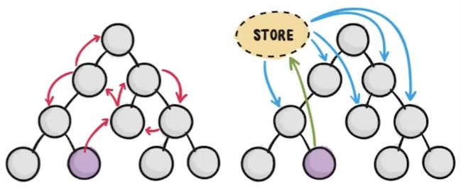

This repository contains the project developed in the second and third part of the Angular course.

The following is a step-by-step description of what was learned in each class.

---

# Angular Course: Components and Services

## Components

### Everything you will learn about components and services in ### Angular

📖 https://angular.io/guide/component-overview

Components are the main building block for Angular applications. Each component consists of:

- An HTML template that declares what renders on the page
- A TypeScript class that defines behavior
- A CSS selector that defines how the component is used in a template
- Optionally, CSS styles applied to the template

### What are components?

The best way to create a component is with the Angular CLI. You can also create a component manually.

To create a component using the Angular CLI:

- From a terminal window, navigate to the directory containing your application.
- Run the comand:

```
ng generate component <component-name>
```

Or in a short statement

```
ng g c <component-name>
```

Where `component-name>` is the name of your component.

By default, this command creates the following:

- A folder named after the component
- A component file, `<component-name>.component.ts`
- A template file, `component-name>.component.html`
- A CSS file, `component-name.component.css`
- A testing specification file, `component-name.component.spec.ts`

By creating a new component using Angular CLI, it automatically generates the import statement of the new module into `app.module.ts` file.

The new module can be incorporated into the main component using its own tag. This tag name is defined into the `<component-name>.component.ts` file.

For example, in this case the selector has the `app-img` tag.

```ts
// src/app/components/img/img.component.ts

import { Component, OnInit } from "@angular/core";

@Component({
  selector: "app-img", 👈
  templateUrl: "./img.component.html",
  styleUrls: ["./img.component.scss"],
})
export class ImgComponent implements OnInit {
  constructor() {}

  ngOnInit(): void {}
}
```

It can be used into the `app.component.html` by adding the corresponding tag:

```html
<!-- src/app/app.component.html -->

<app-img></app-img>
```

### Using Inputs

Inputs are used for import data from the Father component to the Child component.

The decorator `@Input()` is implemented into the Child's `<component-name>.component.ts` file.

Example:

```ts
// src/app/components/img/img.component.ts

import { Component, OnInit, Input } from '@angular/core';  👈

@Component({
  selector: 'app-img',
  templateUrl: './img.component.html',
  styleUrls: ['./img.component.scss'],
})
export class ImgComponent implements OnInit {
  @Input() img: string = 'img value';  👈

  constructor() {}

  ngOnInit(): void {}
}
```

```html
<!-- src/app/app.component.html -->

 👈
<ng-template #elseImg>
  
</ng-template>
```

The value is defined dinamically with ngModel into the parent html element:

```html
<!-- src/app/app.component.html -->

<input type="text" [(ngModel)]="imgParent" />
<app-img [img]="imgParent"></app-img> 👈
```

```ts
// src/app/app.component.ts

import { Component } from '@angular/core';

@Component({
  selector: 'app-root',
  templateUrl: './app.component.html',
  styleUrls: ['./app.component.scss'],
})
export class AppComponent {
  imgParent = 'https://picsum.photos/id/15/250'; 👈
}
```

### Using Outputs

Outputs are used for export data from the Child component to the Father component.

The decorator `@Output()` is implemented into the Child's `<component-name>.component.ts` file. It also needs to import the `@EventEmitter` decorator.

Example:

```ts
// src/app/components/img/img.component.ts

import { Component, OnInit, Input, Output, EventEmitter } from "@angular/core"; 👈

@Component({
  selector: "app-img",
  templateUrl: "./img.component.html",
  styleUrls: ["./img.component.scss"],
})
export class ImgComponent implements OnInit {
  @Input() img: string = "img value";
  defaultImage = "https://picsum.photos/id/1/250";

  @Output() loaded = new EventEmitter<string>();  👈

  constructor() {}

  ngOnInit(): void {}

  imgLoader() {
    console.log(`Image ${this.img} is loaded from Child`);
    this.loaded.emit(this.img); 👈
  }

  imgError() {
    this.img = this.defaultImage;
  }
}
```

```html
<!-- src/app/app.component.html -->


<ng-template #elseImg>
  
</ng-template>
```

`(load)` recieves an event on image succesfull loading, and emit this event. `ingLoader` function recieve this event and excecute the function, where the `loaded` variable emit the info to the Parent component.

Into the Parent component, this data is recieved:

```html
<!-- src/app/app.component.html -->

<input type="text" [(ngModel)]="imgParent" />
<app-img (loaded)="onLoaded($event)" [img]="imgParent"></app-img> 👈
```

```ts
// src/app/app.component.ts

import { Component } from '@angular/core';

@Component({
  selector: 'app-root',
  templateUrl: './app.component.html',
  styleUrls: ['./app.component.scss'],
})
export class AppComponent {
  imgParent = 'https://picsum.photos/id/15/250';

  onLoaded(img: string) {
    console.log(`Image ${img} is loaded from Parent`); 👈
  }
}
```

### Component for Product

Use Angular CLI to create a new component

```
ng g c components/product
```

This new component renderize the product box. While in the main app component is used \*ngFor to renderize all objects in an array of products.

### Component lifecycle

```ts
// ../<component-name>.component.ts

import {
  Component,
  OnInit,
  OnChanges,
  AfterViewInit,
  OnDestroy,
} from "@angular/core";

@Component({
  selector: "app-<component-name>",
  templateUrl: "./<component-name>.component.html",
  styleUrls: ["./<component-name>.component.scss"],
})
export class ComponentName
  implements OnInit, OnChanges, AfterViewInit, OnDestroy
{
  constructor() { 👈
    // run before render
    // do not run async functions here
    // it runs only once per component creation
    console.log("constructor", "img value:", this.img);
  }

  ngOnChanges(): void { 👈
    // run before render
    // run many times, once every change occur, it recharges at inputs changes
    // stay listening
    // detect changes here
    console.log("ngOnChanges", "img value:", this.img);
  }

  ngOnInit(): void { 👈
    // run before render
    // run async functions here
    // run only once time at inicialization
    // do not detect changes here
    console.log("ngOnInit", "img value:", this.img);
  }

  ngAfterViewInit(): void { 👈
    // run after render
    // children handler
    console.log("ngAfterViewInit", "img value:", this.img);
  }

  ngOnDestroy(): void { 👈
    // run on component delete
    console.log("ngOnDestroy", "img value:", this.img);
  }
}
```

### ngDestroy &amp; SetInput

Processes that continues running when are destroyed, needs to be stoped.

Example:

```ts
// ../<component-name>.component.ts

export class ComponentName implements OnInit, OnDestroy {
  counter = 0;
  counterFunction: number | undefined;

  ngOnInit(): void {
    this.counterFunction = window.setInterval(() => {
      this.counter += 1;
      console.log("counter running");
    }, 1000);
    // setInterval continues running even if it is destroyed, it needs to be stopped
  }

  ngOnDestroy(): void {
    window.clearInterval(this.counterFunction); // make interval to stop running on destroy
  }
}
```

Changes can be verified with `@SimpleChanges` decorator

```ts
// ../<component-name>.component.ts

  ngOnChanges(changes: SimpleChanges): void {
    console.log('changes', changes);
  }
```

### Product List

Use Angular CLI to create a new component for the products grid

```
ng g c components/products
```

This new component renderize the product grid

Reeorganize components with correct functionality

### Components and Header

Styles has their own scope. It is not possible to change Child components styles from Parent components style files.

For doing this, the global style `/src/styles.scss` is employed.

Use Angular CLI to create a new component for the header

```
ng g c components/nav
```

### Implementing the sideMenu

Add html and css for sidebar menu.

### Parent and child communication

A new button is added into product component to add products to shopping cart. This component is conected to the parent component, products, to send product added data.

Parent component recieve product data and push it into a cart product array. This new array is used to handle the amount, the total price and the list of added products.

## Services

### Understanding services

📖 https://angular.io/tutorial/toh-pt4

Components shouldn't fetch or save data directly and they certainly shouldn't knowingly present fake data. They should focus on presenting data and delegate data access to a service.

Services are a great way to share information among classes that don't know each other.

Use Angular CLI to create a new service

```
ng g s services/store
```

All the operation functions are moved to the service.

To use the service functionality into the component, an import is needed

```ts
// ../<component-name>.component.ts
import { StoreService } from '../../services/store.service'; 👈

  ...

  constructor(private storeService: StoreService) {} 👈

    ...
```

### What is dependency injection?

In software engineering, **singleton** or single instance is a design pattern that restricts the creation of objects belonging to a class or the value of a type to a single object. It is intended to ensure that a class has only one instance and to provide a global access point to it.

If two components import one service, Angular creates only one instance of that service and use it to provide both components.

This injection pattern allow services to import other services, but if service A imports service B, service B can't import service A. Circular injection is not supported.

### Getting data from an API

📖 https://angular.io/guide/http

Most front-end applications need to communicate with a server over the HTTP protocol, to download or upload data and access other back-end services. Angular provides a client HTTP API for Angular applications, the `HttpClient` service class in `@angular/common/http`.

Use Angular CLI to create a new service

```
ng g s services/products
```

Import Http Module in `app.module.ts` file

```ts
// src/app.module.ts

import { HttpClientModule } from '@angular/common/http'; 👈

...

@NgModule({
  declarations: [
    AppComponent,
    ImgComponent,
    ProductComponent,
    ProductsComponent,
    NavComponent,
  ],
  imports: [BrowserModule, AppRoutingModule, FormsModule, HttpClientModule], 👈
  providers: [],
  bootstrap: [AppComponent],
})
export class AppModule {}

```

Create http request into the service file. For example:

```ts
// src/app/services/product.service.ts

import { Injectable } from "@angular/core";
import { HttpClient } from "@angular/common/http"; 👈

@Injectable({
  providedIn: "root",
})
export class ProductsService {
  constructor(private http: HttpClient) {} 👈

  getAllProducts() {
    return this.http.get("http://fakestoreapi.com/products"); 👈
  }
}
```

```ts
// src/app/components/products/products.service.ts

import { Component, OnInit } from '@angular/core';

import { Product } from '../../models/product.model';
import { StoreService } from '../../services/store.service';
import { ProductsService } from '../../services/products.service'; 👈

@Component({
  selector: 'app-products',
  templateUrl: './products.component.html',
  styleUrls: ['./products.component.scss'],
})
export class ProductsComponent implements OnInit {
  myShoppingCart: Product[] = [];
  total: number = 0;
  products: Product[] = []; 👈

  constructor(
    private storeService: StoreService,
    private productsService: ProductsService 👈
  ) {
    this.myShoppingCart = this.storeService.getShoppingCart();
  }
  ngOnInit(): void {
    this.productsService.getAllProducts().subscribe((data) => { 👈
      this.products = data;
    });
  }

  onAddToCart(product: Product) {
    this.storeService.addProduct(product);
    this.total = this.storeService.getTotal();
  }
}

```

The model should match with the data type obtained from the API

```ts
// src/app/models/product.model.ts

export interface Product {
  id: string;
  title: string;
  price: number;
  image: string;
  description: string;
  category: string;
}
```

## Pipes and Directives

### Understanding pipes

📖 https://angular.io/guide/pipes

Use pipes to transform strings, currency amounts, dates, and other data for display. Pipes are simple functions to use in template expressions to accept an input value and return a transformed value. Pipes are useful because you can use them throughout your application, while only declaring each pipe once. For example, you would use a pipe to show a date as April 15, 1988 rather than the raw string format.

Pipes are implemented into html files.

For example, date types can be personalized to display a custom format.

📖 https://angular.io/api/common/DatePipe

All pipes can be explored in Angular documentation

📖 https://angular.io/api?type=pipe

### Building your own pipe

Use Angular CLI to create a new pipe

```
ng g p pipes/reverse
```

In the `reverse.pipe.ts` file:

```ts
// src/app/pipes/reverse.pipe.ts

import { Pipe, PipeTransform } from "@angular/core";

@Pipe({
  name: "reverse", 👈
})
export class ReversePipe implements PipeTransform {
  transform(value: string): string {
    return value.split("").reverse().join("");
  }
}
```

It can be used into an html component file like this:

```html
<!-- src/app/components/product.component.html -->

<app-img [imge]="product.image"></app-img>
<p>{{ product.price | currency:'USD ' }}</p>
<h3>{{ product.title | reverse 👈 }}</h3>
<button (click)="addToCart()">Add to cart</button>
```

date-fns is installed for perform another pipe example

```
npm i date-fns
```

Use Angular CLI to create a new pipe

```
ng g p pipes/timeAgo
```

In the `time-ago.pipe.ts` file:

```ts
// src/app/pipes/time-ago.pipe.ts

import { Pipe, PipeTransform } from "@angular/core";
import { formatDistance } from "date-fns";

@Pipe({
  name: "timeAgo", 👈
})
export class TimeAgoPipe implements PipeTransform {
  transform(value: Date): string {
    return formatDistance(new Date(), value);
  }
}
```

It can be used into an html component file like this:

```html
<!-- src/app/components/product.component.html -->

<p>{{ date | timeAgo }}</p>
```

### Getting to know directives

📖 https://angular.io/guide/attribute-directives

Attribute directives are useful to change the appearance or behavior of DOM elements and Angular components.

Use Angular CLI to create a new pipe

```
ng g d directives/highlight
```

Customize the directive into the `src/app/directives/highlight.directive.ts`:

```ts
// src/app/directives/highlight.directive.ts

import { Directive, ElementRef, HostListener } from "@angular/core";

@Directive({
  selector: "[appHighlight]",
})
export class HighlightDirective {
  @HostListener("mouseenter") onMouseEnter() {
    this.element.nativeElement.style.backgroundColor = "red";
  }

  @HostListener("mouseleave") onMouseLeave() {
    this.element.nativeElement.style.backgroundColor = "green";
  }

  constructor(private element: ElementRef) {
    this.element.nativeElement.style.backgroundColor = "yellow";
  }
}
```

It can be used into an html component file like this:

```html
<!-- src/app/components/product.component.html -->

<app-img [imge]="product.image"></app-img>
<p>{{ product.price | currency:'USD ' }}</p>
<h3>{{ product.title | reverse }}</h3>
<p appHighlight 👈>{{ product.description }}</p>
<button (click)="addToCart()">Add to cart</button>
```

## Best Practices

### Basic reactivity

For data transmition into not adjacent components, observables can be utilized. This type of comunication utilize an storage, because of this import and export are not needed.



For example, an observable can be created into `store.service.ts` to send the shipping cart array to the navbar:

```ts
// src/app/services/store.service.ts

import { Injectable } from "@angular/core";
import { BehaviorSubject } from "rxjs"; 👈

import { Product } from "../models/product.model";

@Injectable({
  providedIn: "root",
})
export class StoreService {
  private myShoppingCart: Product[] = [];
  private myCart = new BehaviorSubject<Product[]>([]); 👈

  myCart$ = this.myCart.asObservable(); // new observable 👈

  total: number = 0;

  constructor() {}

  addProduct(product: Product) {
    this.myShoppingCart.push(product);
    this.myCart.next(this.myShoppingCart); // notify all subscribers and send this.myShoppingCart data 👈
  }

  getShoppingCart() {
    return this.myShoppingCart;
  }

  getTotal() {
    return (this.total = this.myShoppingCart.reduce(
      (sum, item) => sum + item.price,
      0
    ));
  }
}
```

The nav component is going to subscribe and wait for shopping cart changes:

```ts
// src/app/components/nav.component.ts

import { Component, OnInit } from "@angular/core";

import { StoreService } from "../../services/store.service"; 👈

@Component({
  selector: "app-nav",
  templateUrl: "./nav.component.html",
  styleUrls: ["./nav.component.scss"],
})
export class NavComponent implements OnInit {
  activeMenu = false;
  counter = 0; 👈

  constructor(private storeService: StoreService) {} 👈

  ngOnInit(): void {
    // subscribe and await for changes 👈
    this.storeService.myCart$.subscribe((products) => { 👈
      this.counter = products.length;
    });
  }

  toggleMenu() {
    this.activeMenu = !this.activeMenu;
  }
}
```

### Angular style guide and linters

📖 https://angular.io/guide/styleguide

To add a lint from angular:

```
ng add @angular-eslint/schematics
```

To check for optimization and good practices, run

```
ng lint
```

---

# Angular Course: REST API consumption

## Http Basic

### GET Requests

Review the http request into the product service file:

```ts
// src/app/services/product.service.ts

import { Injectable } from "@angular/core";
import { HttpClient } from "@angular/common/http"; 👈

@Injectable({
  providedIn: "root",
})
export class ProductsService {
  constructor(private http: HttpClient) {} 👈

  getAllProducts() {
    return this.http.get("http://fakestoreapi.com/products"); 👈
  }
}
```

### Product detail

To get a single product detail, the get request is performed:

```ts
// src/app/components/products/products.component.ts

export class ProductsComponent implements OnInit {
  ...

  onShowDetail(id: string) {
    this.productsService
      .getProduct(id) 👈
      .subscribe((data) => console.log('product', data));
  }
}
```

```ts
// src/app/services/product.service.ts

import { Injectable } from "@angular/core";
import { HttpClient } from "@angular/common/http"; 👈
import { Product } from "../models/product.model";

@Injectable({
  providedIn: "root",
})
export class ProductsService {
  constructor(private http: HttpClient) {} 👈

  private apiUrl = "https://young-sands-07814.herokuapp.com/api/products"; 👈

  getAllProducts() {
    return this.http.get<Product[]>(this.apiUrl);
  }

  getProduct(id: string) { 👈
    return this.http.get<Product>(`${this.apiUrl}/${id}`); 👈
  }
}
```

### Creating slides

Swiper library is used to display slides

📖 https://swiperjs.com/angular

```
npm i swiper
```

Import SwiperModule module into `src/app.module.ts` file

```ts
// src/app.module.ts

import { SwiperModule } from "swiper/angular"; 👈

@NgModule({
  imports: [SwiperModule], 👈
})
export class YourAppModule {}
```

And into the `src/styles.scss` file

```scss
// src/styles.scss;

@import "swiper/css/bundle"; 👈
```

Then, manage data into the products.component.ts file:

```ts
// src/app/components/products/products.component.ts

...

export class ProductsComponent implements OnInit {
  ...

  productChosen!: Product; 👈

  ...

  onShowDetail(id: string) { 👈
    this.productsService.getProduct(id).subscribe((data) => { 👈
      this.toggleProductDetail();
      this.productChosen = data;
    });
  }
```

And use it into the `products.component.html` file:

```html
<!-- src/app/components/products/products.component.html -->

<div class="product-detail" [class.active]="showProductDetail">
  <div *ngIf="productChosen">
    <button (click)="toggleProductDetail()">Close</button>
    <h2>{{ productChosen.title }}</h2>
    <swiper 👈 [slidesPerView]="1">
      <ng-template swiperSlide *ngFor="let img of productChosen.images">
        
      </ng-template>
    </swiper>
    <p>{{ productChosen.description }}</p>
  </div>
</div>
```

### POST requests

The first step to send a post request is create its dto into the models file:

```ts
// src/app/models/product.model.ts

export interface Category {
  id: string;
  name: string;
}

export interface Product {
  id: string;
  title: string;
  price: number;
  images: string[];
  description: string;
  category: Category;
}

export interface CreateProductDto extends Omit<Product, "id" | "category"> { 👈
  categoryId: number; 👈
}
```

The post request is shown into the `products.service.ts` file:

```ts
// src/app/services/products.service.ts

  import { Product, CreateProductDto } from '../models/product.model'; 👈

  ...

  create(dto: CreateProductDto) { 👈
    return this.http.post<Product>(this.apiUrl, dto); 👈
  }
}
```

This request is configured into the `products.component.ts` file:

```ts
// src/app/components/products/products.component.ts

import { Product, CreateProductDto } from '../../models/product.model'; 👈

...

  createNewProduct() { 👈
    const product: CreateProductDto = {
      title: 'The product to be found 513213513541',
      description: 'The product description',
      price: 100,
      images: ['https://placeimg.com/640/480/any'],
      categoryId: 1,
    };
    this.productsService.create(product).subscribe((data) => { 👈
      this.products.unshift(data);
    });
  }
```

_The product info is created into the function for a didactical purpose._

This function is excecuted by a button click into the `products.component.html` file:

```html
<!-- src/app/components/products/products.component.html -->

<button (click)="createNewProduct()">Create product</button> 👈
```

### PUT and PATCH requests

Put and patch requests follow the same logic as get and post.

### DELETE requests

Delete request follow the same logic as previous requests.

### Url Parameters / Pagination

Params are send to the API this way:

```ts
// src/app/services/products.service.ts

  getProductsByPage(limit: number, offset: number) {
    return this.http.get<Product[]>(this.apiUrl, { 👈
      params: { limit, offset }, 👈
    });
  }
```

This request is configured into the `products.component.ts` file:

```ts
// src/app/components/products/products.component.ts

export class ProductsComponent implements OnInit {

  ...

  limit = 8; 👈
  offset = 0; 👈

  ...

  ngOnInit(): void {

    ...

  }

  loadMore() { 👈
    this.productsService
      .getProductsByPage(this.limit, this.offset) 👈
      .subscribe((data) => {
        this.products = this.products.concat(data); 👈
        this.offset += this.limit; 👈
      });
  }

```

This function is excecuted by a button click into the `products.component.html` file:

```html
<!-- src/app/components/products/products.component.html -->

<button (click)="loadMore()">Load more products</button> 👈
```

### Observable vs. Promise

- Observable:
  - Omitting / answering multiple responses.
  - Transmission of multiple data
  - Allows data transformations and unsubscription
  - Allows to transform the response (pipes)
  - Continuous listening possible : events / responsive / fetches
- Promise:
  - Returns a single response
  - Runs only once
  - Simplicity

### Retrying a request

For retry requests can be done into the `products.component.ts` file:

```ts
// src/app/components/products/products.component.ts

import { retry } from 'rxjs';

  ...

  getAllProducts(limit?: number, offset?: number) {
    let params = new HttpParams();
    if (limit && (offset || offset === 0)) {
      params = params.set('limit', limit);
      params = params.set('offset', offset);
    }
    return this.http.get<Product[]>(this.apiUrl, { params }).pipe(retry(3)); // retry request 3 times (4 total) 👈
  }

```

It is possible to implement `retryWhen`, from rxjs, to add a condition for the retry action.

## Best Practices

### The CORS Problem

📖 https://developer.mozilla.org/en-US/docs/Web/HTTP/CORS

Backend must enable cors. If it is not possible, then there is a solution for development.

Angular can create a proxy for development purposes.

First create a `proxy.config.json` in the root folder:

```json
{
  "/api/*": {
    "target": "https://young-sands-07814.herokuapp.com",
    "secure": true,
    "logLevel": "debug",
    "changeOrigin": true
  }
}
```

This will change the origin of the request to match with the api domain.

Then, the api direction can be modified from:

```ts
private apiUrl = 'https://young-sands-07814.herokuapp.com/api/products';
```

To:

```ts
private apiUrl = '/api/products';
```

A new script must be added into the package.json file:

```json
  "scripts": {
    "ng": "ng",
    "start": "ng serve",
    "start:proxy": "ng serve --proxy-config ./proxy.config.json", 👈
    "build": "ng build",
    "watch": "ng build --watch --configuration development",
    "test": "ng test",
    "lint": "ng lint"
  },
```

And finally run the project with:

```
npm run start:proxy
```

### Handling environments

Angular present two default environments, production and development. This can be found into `/src/environments` folder.

The development configuration is going to be into the `environment.ts` file.

```ts
// /src/environments/environment.ts

export const environment = {
  production: false,
  API_URL: "", 👈
};
```

The production configuration is going to be into the `environment.prod.ts` file.

```ts
// /src/environments/environment.prod.ts

export const environment = {
  production: true,
  API_URL: "https://young-sands-07814.herokuapp.com", 👈
};
```

The API url is added into those files to manage the conection dinamically in both environments.

For accomplish this, the API url must be configured as follows:

```ts
// src/app/services/products.service.ts

...

import { environment } from '../../environments/environment'; 👈

...

  private apiUrl = `${environment.API_URL}/api/products`; 👈

```

In this case, `ng serve` is going to run the project with the development configuration and `ng build` is going to run with the production configuration.

### Error handling

Errors can be handled into the service file:

```ts
// src/app/services/products.service.ts

getProduct(id: string) {
  return this.http.get<Product>(`${this.apiUrl}/${id}`).pipe( 👈
    catchError((error: HttpErrorResponse) => { 👈
      if (error.status === HttpStatusCode.Conflict) { 👈
        return throwError(() => 'algo esta mal en el server'); 👈
      }
      if (error.status === HttpStatusCode.NotFound) {
        return throwError(() => 'no se encuentra el producto capo');
      }
      if (error.status === HttpStatusCode.Conflict) {
        return throwError(() => 'no estas autorizado');
      }
      return throwError(() => 'Ups algo salio mal');
    })
  );
}
```

To display an error message, sweetalert2 library is installed

```
npm install sweetalert2
```

Sweetalert2 has a lot of alerts available:

📖 https://sweetalert2.github.io

Into the controller:

```ts
import Swal from 'sweetalert2'; 👈

...

  export class ProductsComponent implements OnInit {

    ...

    statusDetail: 'loading' | 'success' | 'error' | 'init' = 'init'; 👈

    ...

    onShowDetail(id: string) {
      this.statusDetail = 'loading';
      this.toggleProductDetail();
      this.productsService.getProduct(id).subscribe({
        next: (v) => this.showDetailOk(v),
        error: (e) => this.showDetailError(e),
        complete: () => console.log('complete'),
      });
      //   .subscribe(                 <--- //depreciated
      //   (data) => {
      //     this.productChosen = data;
      //     this.statusDetail = 'success';
      //   },
      //   (errorMsg) => {
      //     this.productChosen = errorMsg;
      //     window.alert(errorMsg);
      //     this.statusDetail = 'error';
      //   }
      // );
    }


    showDetailOk(data: Product) {
      this.statusDetail = 'success';
      console.log('Producto obtenido:', data);
      // this.toggleProductDetail();
      this.productChosen = data;
    }

    showDetailError(error: Error) {
      this.statusDetail = 'error';
      // this.productChosen = errorProduct    <-- Pending. An error product must be shown
      Swal.fire({
        title: 'Error',
        text: error,
        icon: 'error',
        confirmButtonText: 'ok',
      });
    }

    ...

  }
```

### Transforming requests

It`s better to obtain the information all processed from the backend, but if a transformation (or addition) of any information is needed, there is a method to do so.

First of all, the `product.model.ts` file has to add the new parameter:

```ts
// src/app/models/product.model.ts

export interface Product {
  id: string;
  title: string;
  price: number;
  images: string[];
  description: string;
  category: Category;
  taxes?: number; 👈
}
```

Then, the transformation occur into the service file:

```ts
// src/app/services/product.service.ts

import { map } from 'rxjs'; 👈


  getAllProducts(limit?: number, offset?: number) {
    let params = new HttpParams();
    if (limit && (offset || offset === 0)) {
      params = params.set('limit', limit);
      params = params.set('offset', offset);
    }
    return this.http.get<Product[]>(this.apiUrl, { params }).pipe( 👈
      retry(3),
      map((products) => 👈
        products.map((item) => { 👈
          return {
            ...item,
            taxes: 0.19 * item.price, 👈
          };
        })
      )
    );
  }
```

And into the html file:

```html
<!-- /src/app/components/product/product.component.html -->

<app-img *ngIf="product.images.length > 0" [imge]="product.images[0]"></app-img>
<h3>{{ product.title }}</h3>
<p>Price: {{ product.price | currency:'USD ' }}</p>
<p *ngIf="product.taxes" 👈>Taxes: {{ product.taxes 👈 | currency:'USD ' }}</p>
<button (click)="onShowDetail()">View more details</button>
<button (click)="addToCart()">Add to cart</button>
```

### Preventing callback hell

In the case where is needed to excecute multiple requests, the way to avoid the callback hell into observables is using `rxjs`.

`switchMap` method is used when one action depends on the previous action.

`zip` is used when actions don't depend on each other.

For example, into the `<service-name>.service.ts` file:

```ts
import { switchMap } from 'rxjs/operators'; 👈
import { zip } from 'rxjs'; 👈

  ...

  fetchReadAndUpdate(id: string, dto: UpdateProductDto) {
    return zip(this.getProduct(id), this.update(id, dto)); 👈
  }

  fetchReadAndUpdatePromise(id: string, dto: UpdateProductDto) {
    return this.getProduct(id).pipe(
      switchMap((product) => this.update(product.id, dto)) 👈
    );
  }

  ...

```

For example, into the `<component-name>.component.ts` file:

```ts
// .../<component-name>.component.ts

  ...

  reandAndUpdate(id: string) {
    this.productsService
      .fetchReadAndUpdate(id, { title: 'change' }) 👈
      .subscribe((response) => {
        const getResponse = response[0];
        const updateResponse = response[1];
        console.log(getResponse, updateResponse);
      });
  }

  reandAndUpdatePromise(id: string) {
    this.productsService
      .fetchReadAndUpdatePromise(id, { title: 'change' }) 👈
      .subscribe((data) => {
        console.log(data);
      });
  }

  ...

```

## Auth

### Login and Auth handling

Create 3 services:

```
ng g s services/auth && ng g s services/users && ng g s services/token
```

Create user model:

```ts
// src/app/models/user.model.ts

export interface User { 👈
  id: string;
  email: string;
  password: string;
  name: string;
}

export interface CreateUserDTO extends Omit<User, "id"> {} 👈
```

Create auth model:

```ts
// src/app/models/auth.model.ts

export interface Auth { 👈
  access_token: string;
}
```

Into user service, configure the creation of a new user:

```ts
// src/app/services/user.service.ts

import { Injectable } from "@angular/core";
import { HttpClient } from "@angular/common/http";

import { environment } from "./../../environments/environment";
import { User, CreateUserDTO } from "./../models/user.model";

@Injectable({
  providedIn: "root",
})
export class UsersService {
  private apiUrl = `${environment.API_URL}/api/users`;

  constructor(private http: HttpClient) {}

  create(dto: CreateUserDTO) {
    return this.http.post<User>(this.apiUrl, dto); 👈
  }

  getAll() {
    return this.http.get<User[]>(this.apiUrl);
  }
}
```

Into the auth service configure the login:

```ts
// src/app/services/auth.service.ts

import { Injectable } from "@angular/core";
import { HttpClient } from "@angular/common/http";

import { environment } from "./../../environments/environment";
import { Auth } from "./../models/auth.model";

@Injectable({
  providedIn: "root",
})
export class AuthService {
  private apiUrl = `${environment.API_URL}/api/auth`;

  constructor(private http: HttpClient) {}

  login(email: string, password: string) {
    return this.http.post<Auth>(`${this.apiUrl}/login`, { email, password });
  }
}
```

For simplicity, the service and auth services are called into the app component. But a user/auth component must be created.

Into the app component:

```ts
// src/app/app.component.ts

import { Component } from '@angular/core';

import { AuthService } from './services/auth.service'; 👈
import { UsersService } from './services/users.service'; 👈

@Component({
  selector: 'app-root',
  templateUrl: './app.component.html',
  styleUrls: ['./app.component.scss'],
})
export class AppComponent {
  constructor(
    private authService: AuthService, 👈
    private usersService: UsersService 👈
  ) {}

  createUser() {
    this.usersService 👈
      .create({ 👈
        name: 'Nombre',
        email: 'email@mail.com',
        password: '123456',
      })
      .subscribe((data) => console.log(data));
  }

  login() {
    this.authService 👈
      .login('email@mail.com', '123456') 👈
      .subscribe((data) => console.log(data.access_token));
  }
}

```

And they are excecuted throug a button into the app html:

```html
<!-- src/app/app.component.html -->

<button (click)="createUser()">Create User</button>
<button (click)="login()">Login</button>
```

### Handling headers

The authorization must be sent with this sintaxis:

```
Authorization: <type> <credentials>
Authorization: Bearer ...
```

_There is a blank between `<type>` and `<credentials>`, this is important to avoid a typo error_

First, the token must be initialized and saved into a new variable `token`:

```ts
// src/app/app.component.ts

token = ""; 👈

  ...

  login() {
    this.authService
      .login('email@mail.com', '123456')
      .subscribe((data) => (this.token = data.access_token)); 👈
  }

  getProfile() {
    this.authService.getProfile(this.token).subscribe((profile) => { 👈
      console.log(profile);
    });
  }

  ...

```

Into the auth service:

```ts
// src/app/services/auth.service.ts

  ...

  getProfile(token: string) {
    // const headers = new HttpHeaders();
    // headers.set('Authorization',  `Bearer ${token}`);
    return this.http.get<User>(`${this.apiUrl}/profile`, { 👈
      headers: {
        Authorization: `Bearer ${token}`, 👈
        // 'Content-type': 'application/json'
      },
    });
  }

  ...

```

And excecuted throug a button into the app html:

```html
<!-- src/app/app.component.html -->

<button (click)="getProfile()">Profile</button> 👈
```

To display the user email in the nav bar:

```ts
// src/app/component/nav/nav.component.ts

import { Component, OnInit } from "@angular/core";

import { StoreService } from "../../services/store.service";
import { AuthService } from "../../services/auth.service"; 👈
import { User } from "../../models/user.model";

@Component({
  selector: "app-nav",
  templateUrl: "./nav.component.html",
  styleUrls: ["./nav.component.scss"],
})
export class NavComponent implements OnInit {
  activeMenu = false;
  counter = 0;
  token = ""; 👈
  profile: User | null = null; 👈

  constructor(
    private storeService: StoreService,
    private authService: AuthService 👈
  ) {}

  ngOnInit(): void {
    // subscribe and await for changes
    this.storeService.myCart$.subscribe((products) => {
      this.counter = products.length;
    });
  }

  toggleMenu() {
    this.activeMenu = !this.activeMenu;
  }

  login() {
    this.authService.login("email@mail.com", "123456").subscribe((data) => { 👈
      this.token = data.access_token;
      // a switchMap can be implemented here
      this.getProfile();
    });
  }

  getProfile() {
    this.authService.getProfile(this.token).subscribe((user) => { 👈
      console.log(user);
      this.profile = user; 👈
    });
  }
}
```

```html
<!-- src/app/components/nav/nav.component.html -->

<div class="account">
  <button *ngIf="!token; else elseBlock" (click)="login()">Login</button> 👈
  <ng-template #elseBlock>{{ profile?.email }}</ng-template> 👈
</div>
```

### Using interceptors

Interceptors are between the App and the Backend

To generate a new interceptor with Angular CLI:

```
ng g interceptor interceptors/time --flat
```

The time interceptor looks like this:

```ts
// src/app/interceptors/time.interceptor.ts

import { Injectable } from "@angular/core";
import {
  HttpRequest,
  HttpHandler,
  HttpEvent,
  HttpInterceptor,
} from "@angular/common/http";
import { Observable } from "rxjs";
import { tap } from "rxjs/operators";

@Injectable()
export class TimeInterceptor implements HttpInterceptor {
  constructor() {}

  intercept(
    request: HttpRequest<unknown>,
    next: HttpHandler
  ): Observable<HttpEvent<unknown>> {
    const start = performance.now(); 👈
    return next.handle(request).pipe( 👈
      tap(() => {
        const time = performance.now() - start + "ms";
        console.log(request.url, time);
      })
    );
  }
}
```

_`tap` can be used to excecute certain code without a response to be sent or a modification to be performed to the data._

The interceptor must be provided to the app manually into the app module file:

```ts
//src/app/app.module.ts

import { HttpClientModule, HTTP_INTERCEPTORS } from '@angular/common/http'; 👈

import { TimeInterceptor } from './interceptors/time.interceptor'; 👈

@NgModule({

  ...

  providers: [
    { provide: HTTP_INTERCEPTORS, useClass: TimeInterceptor, multi: true }, 👈
  ],

  ...

})
export class AppModule {}
```

This interceptor will show the time needed to perform a request in the console.

```
/api/products 0.8000000715255737ms
/api/products 1197.4000000953674ms
```

### Sending token with an interceptor

The interceptor feature will be used to save and check for the token in localstorage.

Into the token service, create the functions to save and get the token:

```ts
// src/app/services/token.service.ts

import { Injectable } from "@angular/core";

@Injectable({
  providedIn: "root",
})
export class TokenService {
  constructor() {}

  saveToken(token: string) {
    localStorage.setItem("token", token); 👈
  }

  getToken() {
    const token = localStorage.getItem("token"); 👈
    return token;
  }
}
```

Into the auth service, get the token:

```ts
// src/app/services/auth.service.ts

  ...

  login(email: string, password: string) {
    return this.http
      .post<Auth>(`${this.apiUrl}/login`, { email, password })
      .pipe(
        tap((response) => this.tokenService.saveToken(response.access_token)) 👈
      );
  }

  ...

```

Now, create a new interceptor to check the token:

```
ng g interceptor interceptors/token --flat
```

Into the interceptor, we get the token and if there is a token, we clone the request and add the authorization to the header:

```ts
// src/app/interceptors/token.interceptor.ts

import { Injectable } from "@angular/core";
import {
  HttpRequest,
  HttpHandler,
  HttpEvent,
  HttpInterceptor,
} from "@angular/common/http";
import { Observable } from "rxjs";

import { TokenService } from "./../services/token.service"; 👈

@Injectable()
export class TokenInterceptor implements HttpInterceptor {
  constructor(private tokenService: TokenService) {} 👈

  intercept(
    request: HttpRequest<unknown>,
    next: HttpHandler
  ): Observable<HttpEvent<unknown>> {
    request = this.addToken(request); 👈
    return next.handle(request);
  }

  private addToken(request: HttpRequest<unknown>) {
    const token = this.tokenService.getToken(); 👈
    if (token) {
      const authReq = request.clone({ 👈
        headers: request.headers.set("Authorization", `Bearer ${token}`), 👈
      });
      return authReq; 👈
    }
    return request;
  }
}
```

Finally, add the provider into the app module:

```ts
//src/app/app.module.ts

import { TokenInterceptor } from './interceptors/time.interceptor'; 👈

@NgModule({

  ...

  providers: [
    { provide: HTTP_INTERCEPTORS, useClass: TokenInterceptor, multi: true }, 👈
  ],

  ...

})
export class AppModule {}
```

### Creating an interceptor context

To intercept olny certain requests, context can be implemented.

Into the interceptor file:

```ts
// src/app/interceptors/time.interceptor.ts

import { Injectable } from '@angular/core';
import {
  HttpRequest,
  HttpHandler,
  HttpEvent,
  HttpInterceptor,
  HttpContext, 👈
  HttpContextToken, 👈
} from '@angular/common/http';
import { Observable } from 'rxjs';
import { tap } from 'rxjs/operators';

const CHECK_TIME = new HttpContextToken<boolean>(() => false); // "false" means disabled by default 👈

export function checkTime() {
  return new HttpContext().set(CHECK_TIME, true); // "true" means enable when called into the request 👈
}

@Injectable()
export class TimeInterceptor implements HttpInterceptor {
  constructor() {}

  intercept(
    request: HttpRequest<unknown>,
    next: HttpHandler
  ): Observable<HttpEvent<unknown>> {
    if (request.context.get(CHECK_TIME)) { 👈
      const start = performance.now();
      return next.handle(request).pipe( 👈
        tap(() => {
          const time = performance.now() - start + 'ms';
          console.log(request.url, time);
        })
      );
    }
    return next.handle(request); 👈
  }
}
```

To assign it to certain requests, it should be implemented into each request into the service file.

```ts

...

import { checkTime } from "../interceptors/time.interceptor"; 👈

  ...

  getAllProducts(limit?: number, offset?: number) {
    let params = new HttpParams();
    if (limit && (offset || offset === 0)) {
      params = params.set('limit', limit);
      params = params.set('offset', offset);
    }
    return this.http.get<Product[]>(this.apiUrl, { params, context: checkTime() }).pipe( 👈
      retry(3), // retry request 3 times (4 total)
      map((products) =>
        products.map((item) => {
          return {
            ...item,
            taxes: 0.19 * item.price,
          };
        })
      )
    );
  }

  ...

```

## Files

### Downloading files with Http

### Uploading files with Http
